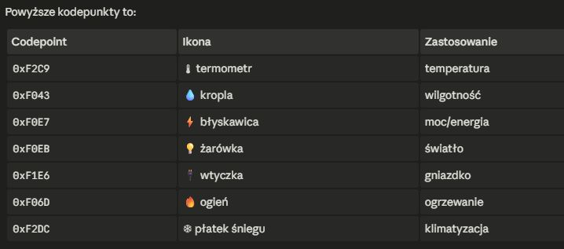

# 🖥️ ESP32-P4 Home Assistant Panel

<p align="center">
  
</p>

<p align="center">
  
  
  
  
  
</p>

> **The first open-source firmware for the Guition JC8012P4A1C (ESP32-P4, 10.1" MIPI-DSI) with native Home Assistant integration, built-in HA Addon, TTS support and motion-activated display.**

---

## ✨ Features

- **LVGL 9.x UI** — entity tiles with automatic or manual layout
- **Home Assistant WebSocket API** — real-time entity state updates
- **Supported entity types** — sensors (temperature, humidity, power, CPU, illuminance), switches (light, fan, switch, input_boolean), presence (person, device_tracker)
- **Arc mode** — sensors displayed as 270° circular gauge with dynamic color
- **Touchable switches** — icon + label change color based on ON/OFF state
- **TTS via Piper** — text-to-speech audio output through onboard speaker
- **Motion-activated display** — camera wakes the screen on movement detection
- **AP Configuration Portal** — on first boot starts `HA-PANEL-<MAC>` access point, configure at `http://192.168.4.1`
- **HA Addon (Dashboard Editor)** — tile and entity editor in the browser, saved to SPIFFS on the device
- **OTA updates** — optional Wi-Fi module (C6) firmware update

---

## 🛒 Hardware

| Component   | Description                                        |
|-------------|----------------------------------------------------|
| MCU         | ESP32-P4 (dual-core RISC-V 400 MHz, 32 MB PSRAM)  |
| Wi-Fi / BLE | ESP32-C6 (slave module, ESP-Hosted SDIO)           |
| Display     | 10.1" 1280×800 MIPI-DSI, JD9365 driver             |
| Touch       | GT911 (I2C, capacitive)                            |
| Audio       | ES8311 codec + speaker (TTS)                       |
| Camera      | Motion detection (wake on motion)                  |
| Battery     | Up to 8h battery life                              |

**Buy the panel:** [Guition JC8012P4A1C on AliExpress](https://www.aliexpress.com)

---

## 🚀 Getting Started

### Requirements

- **ESP-IDF v5.4**
- Python 3.11
- `idf.py` tool

### Build & Flash

```bash
# Activate ESP-IDF environment (Windows PowerShell)
$env:IDF_PATH = "C:\Espressif\frameworks\esp-idf-v5.4"
$env:PYTHONUTF8 = "1"

idf.py set-target esp32p4
idf.py build
idf.py -p COMXX flash
```

### First Boot

1. Panel starts AP: `HA-PANEL-<MAC>`
2. Connect to it with your phone or PC
3. Open `http://192.168.4.1`
4. Enter your Wi-Fi credentials and Home Assistant URL + Long-Lived Token
5. Panel reboots and connects to HA automatically

---

## 🏠 HA Addon — Dashboard Editor

The addon lets you configure tiles and entities from your browser.

**Installation:**
1. Copy `ha_addon/` to `<HA config>/addons/esp32p4_panel/`
2. In HA: **Settings → Add-ons → Add-on Store → ⋮ → Check for updates**
3. Install **"ESP32-P4 Panel"** and start it
4. In addon options set `device_ip` — your panel's IP address

---

## ⚙️ Entity Configuration

Tiles are configured via the HA Addon or directly via API:

```
PUT http://<panel_ip>/api/dashboard
Content-Type: application/json
```

| Field          | Type   | Description                                                                 |
|----------------|--------|-----------------------------------------------------------------------------|
| `entity_id`    | string | HA entity ID (e.g. `sensor.temperature`)                                    |
| `label`        | string | Label shown on the panel                                                    |
| `attribute`    | string | Optional attribute (e.g. `current_temperature`)                             |
| `unit`         | string | Unit (e.g. `°C`, `%`, `W`)                                                  |
| `sensor_type`  | string | `temperature`, `humidity`, `cpu`, `memory`, `power`, `illuminance`, `switch`, `presence`, `device` |
| `display_mode` | string | `text` (default) or `arc` (circular gauge)                                  |

---

## 📁 Repository Structure

```
├── main/               # ESP32-P4 firmware (C/C++)
│   ├── ha_entities.*   # Entity definitions and dashboard JSON parsing
│   ├── ha_service.*    # HA WebSocket client
│   ├── ha_config.*     # Configuration (URL, token) stored in NVS
│   ├── panel_ui.*      # LVGL UI — tiles, rows, animations
│   ├── web_config.*    # HTTP config server (Wi-Fi / HA setup)
│   └── main.cpp        # Entry point
├── ha_addon/           # Home Assistant Addon (Python + Flask)
│   ├── app.py          # HA proxy + device write API
│   ├── config.yaml     # HA addon manifest
│   └── static/         # Addon web UI
├── components/         # Custom fonts and icons
├── common_components/  # Guition BSP (display, touch, audio)
├── CMakeLists.txt
├── sdkconfig.defaults
└── idf_component.yml   # Dependencies (LVGL, esp-websocket-client, cJSON)
```

---

## 📋 Status

> ⚠️ **Beta** — core features work, stability testing in progress.  
> Known issue: occasional random resets under investigation.  
> Reconnection after HA restart — being improved.

---

## 🗺️ Planned

- [ ] Stable reconnect after HA restart
- [ ] Fix random resets (crash analysis in progress)
- [ ] Face recognition (experimental)
- [ ] More entity types
- [ ] Screenshot / display capture tool

---

## 📜 License

## License
Licensed under the Apache 2.0 License. 
BSP code originates from Guition vendor examples.

---

---

# 🇵🇱 Polski / Polish

> **Pierwszy otwarty firmware dla panelu Guition JC8012P4A1C (ESP32-P4, 10.1" MIPI-DSI) z natywną integracją Home Assistant, własnym addonem HA, obsługą TTS i aktywacją ekranu przez wykrycie ruchu.**

---

## ✨ Funkcje

- **UI LVGL 9.x** — kafelki encji z automatycznym lub ręcznym układem
- **WebSocket API Home Assistant** — aktualizacje stanu encji w czasie rzeczywistym
- **Obsługiwane typy encji** — sensory (temperatura, wilgotność, moc, CPU, oświetlenie), przełączniki (light, fan, switch, input_boolean), obecność (person, device_tracker)
- **Tryb Arc** — sensory jako wskaźnik kołowy 270° z dynamicznym kolorem
- **Przełączniki dotykowe** — ikona + etykieta zmieniają kolor na stan ON/OFF
- **TTS przez Piper** — synteza mowy przez wbudowany głośnik
- **Aktywacja ekranu ruchem** — kamera wykrywa ruch i budzi wyświetlacz
- **Portal konfiguracyjny AP** — przy pierwszym uruchomieniu tworzy `HA-PANEL-<MAC>`, konfiguracja pod `http://192.168.4.1`
- **Addon HA (edytor dashboardu)** — edytor kafelków i encji w przeglądarce, zapis do SPIFFS
- **OTA** — opcjonalna aktualizacja firmware modułu Wi-Fi (C6)

---

## 🚀 Szybki start

### Wymagania

- **ESP-IDF v5.4**
- Python 3.11
- Narzędzie `idf.py`

### Budowanie i flashowanie

```bash
# Aktywacja środowiska IDF (Windows PowerShell)
$env:IDF_PATH = "C:\Espressif\frameworks\esp-idf-v5.4"
$env:PYTHONUTF8 = "1"

idf.py set-target esp32p4
idf.py build
idf.py -p COMXX flash
```

### Pierwsze uruchomienie

1. Panel uruchamia AP: `HA-PANEL-<MAC>`
2. Połącz się z telefonem lub PC
3. Otwórz `http://192.168.4.1`
4. Wprowadź dane Wi-Fi oraz adres HA i Long-Lived Token
5. Panel restartuje się i łączy z HA automatycznie

---

## 🏠 Addon HA — Edytor dashboardu

**Instalacja:**
1. Skopiuj `ha_addon/` do `<config HA>/addons/esp32p4_panel/`
2. W HA: **Ustawienia → Dodatki → Sklep z dodatkami → ⋮ → Sprawdź aktualizacje**
3. Zainstaluj **„ESP32-P4 Panel"** i uruchom
4. W opcjach addonu ustaw `device_ip` — adres IP panelu

---

## 📋 Status projektu

> ⚠️ **Beta** — główne funkcje działają, trwają testy stabilizacji.  
> Znany problem: losowe restarty — w trakcie analizy.  
> Reconnect po restarcie HA — w trakcie poprawiania.

---

## 📜 Licencja

## License
Licensed under the Apache 2.0 License. 
BSP code originates from Guition vendor examples.

---

*Made with ❤️ in Bydgoszcz, Poland 🇵🇱*
